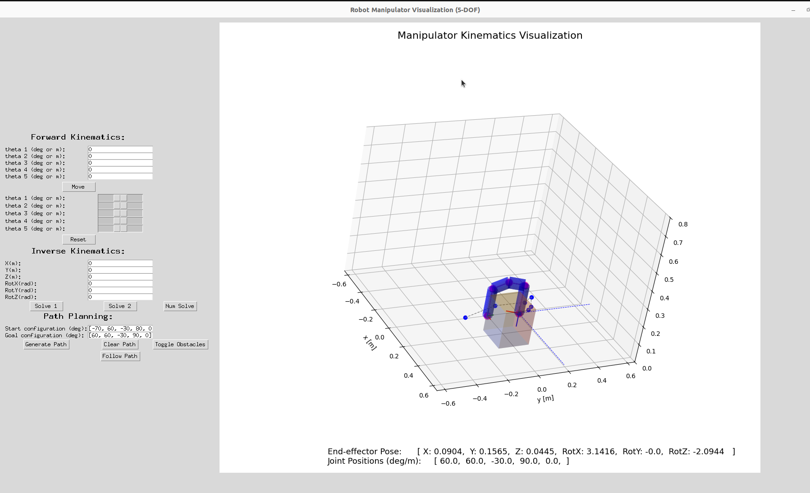

# funrobo_kinematics

**funrobo_kinematics** is a Python-based teaching library for explring robot kinematics, visualization, path and trajectory planning, etc. It serves as a **visualization tool (viz tool)** for working on kinematics modeling and analysis. It accompanies the class activities in modules 2-4 focusing on the following:
1. **Forward position kinematics (FPK)**
2. **Forward velocity kinematics (FVK)**
3. **Inverse position kinematics (IPK)**
4. **Path and trajectory planning**

This branch is specifically for the **Path and trajectory planning** modules.

## Viz Tool - Mainly for Path & Trajectory Planning



## Prerequisites

Please ensure you follow the setups outlined in the main branch [here](https://github.com/OlinCollege-FunRobo/funrobo_kinematics/tree/main?tab=readme-ov-file#prerequisites).

## Step-by-step setup

### Step 1: Fetch new branch
If you already have a fork of the `funrobo-kinematics` repository:
```base
git remote add upstream https://github.com/OlinCollege-FunRobo/funrobo_kinematics.git
git fetch upstream
git checkout -b path-planning upstream/path-planning
git submodule update --init --recursive
```

If you are just cloning the repository afresh:
```base
git clone --recurse-submodules https://github.com/OlinCollege-FunRobo/funrobo_kinematics.git
git checkout -b path-planning origin/path-planning
```


### Step 2: Activate your conda environment
- Activate the environment:
```bash
$ conda activate funrobo
```

### Step 3: Install the submodule Pyroboplan (in edit mode)
```bash
# cd to the project folder
cd funrobo_kinematics
cd libs/pyroboplan
pip install -e .
```


## How to run

### Run the example trajectory generation script

```bash
$ python examples/traj_gen.py
```

### Run the main viz tool script

```bash
$ python examples/hiwonder.py
```


### Generative AI Use Disclosure
- Please make sure to briefly describe what and how generative AI tools were used in developing the contents of your work.
- Acceptable use:
    - To research a related topic to the subject at hand
    - As a substitute to "Stackoverflow" guides on quick programming how-tos, etc.
- Unacceptable use:
    - Directly copying large swaths of code from a ChatGPT response to a prompt in part or entirely related to the assignment's problem

For instance, I used ChatGPT in generating the docstrings for the code in this repository as well as drafting this README. I also used ChatGPT to help to finetune and get directions on some of the functions in the repository.

