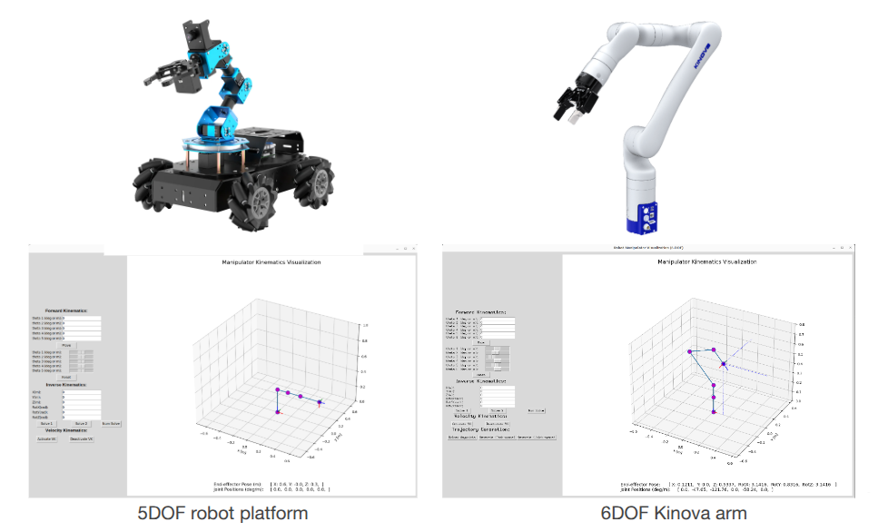

# Mini-Project I: Forward Kinematics

## Overview

This mini-project aims to:

- Strengthen your ability to apply the Denavit-Hartenberg (DH) convention for
  determining forward kinematics equations.
- Practice deriving and applying Jacobian matrices for robot manipulators (e.g.,
  for resolved-rate motion control).
- Develop your proficiency in Python programming for robotics applications.

This assignment will count towards your **final course grade**. It is a
team-based assignment with 2 students in a team.

## What to Do

**Part 1**

- Derive the FPK transforms (DH parameters) for the 5DOF Hiwonder arm
- Derive the FPK transforms (DH parameters) for the 6DOF Kinova arm
- Implement the calc_forward_kinematics() function for both robot arms and verify in the Viz tool

**Part 2**

- Derive the inverse jacobian matrix for the 5DOF robot and implement a resolved-rate motion control (RRMC) with verification in the Viz tool

**Part 3**

- Implement the resolved-rate motion control (RRMC) through gamepad control of the 5DOF Hiwonder hardware (**For instructions on how to use the Hiwonder robot
  platform, please**
  [**see here**](https://github.com/OlinCollege-FunRobo/funrobo_hiwonder))

 

## What to Submit

A **PDF submission** with the following:

- Part 1:
    - Diagram of the 5DOF Hiwonder arm with the coordinate frames clearly defined
    - Derivation of the FPK transforms (DH parameters) for the 5DOF Hiwonder arm
    - Diagram of the 6DOF Kinova arm with the coordinate frames clearly defined
    - Derivation of the FPK transforms (DH parameters) for the 6DOF Kinova arm
    - Link to a screenshot video showing your verification using the viz tool for forward position kinematics for **BOTH robot types**.
    - Code showing all the functions you implemented
- Part 2:
    - Derivation of the jacobian matrix and inverse jacobian matrix for the 5DOF Hiwonder arm **only**
    - Link to a screenshot video showing your verification using the viz tool for RRMC for the 5DOF Hiwonder arm
    - Code showing all the functions you implemented
- Part 3:
    - Code showing all the functions you implemented
    - Link to a video showing gamepad control of the physical 5DOF robot arm
- General: 
    - Link to your team's Github repository with a reasonably setup README
    - **Individual reflections** on the following questions:
      - What did you learn from this? What did you not know before this assignment?
      - What was the most difficult aspect of the assignment?
      - What was the easiest or most straightforward aspect of the assignment?
      - How long did this assignment take? What took the most time (PC setup? Coding
        in Python? Exploring the questions?)?
      - What did you learn about arm forward kinematics that we didn't explicitly
        cover in class?
      - What more would you like to learn about arm forward kinematics?

## Submission Expectations

Your submission will be a pdf document with interspersed diagrams, pictures,
code blocks, and links to videos. Grading for this assignment will be biased
toward the videos you produce (which will have additional expectations) so it
is **imperative** that the links to videos in your document

- Exist
- Have public view access

In general, your code will only be thoroughly examined if there are clear issues
or deficiencies in your videos. If the full range of features defined here are
working and working well - the rest of your work will be assumed to be correct
(as long as it is present in the report). If your videos are not working well,
we will attempt to use the rest of your report to give you any applicable
partial credit. For this reason we **recommend** you include a publicly viewable
link to your repo & work.

For derivation steps such as for the Jacobian, Inverse Jacobian, and Homogenous
Transformation Matrix you may represent your work symbolically as we understand
the full scope of work here can be difficult & messy to visualize.

**Video Expectations**

General Expectations:

- Videos should attempt to show a "full" range of motion (jogging forward and
  backwards for joint angles / showcasing an appropriate range of motion for
  FVK)
- Videos should not show half of a motion and then cut off
- Videos need to be sufficiently long enough to show that whatever feature is
  implemented is working

Video 1: FPK with visualizer

- Video must show individual motion of all the robot joint angles
- All general video expectations

Video 2: FVK/RRMC with visualizer

- Video must show motion through x, y, and z velocity components separately
- Video must show motion through x, y, and z velocity components together
- All general video expectations

Video 3: FVK/RRMC on Robot

- Video must show motion through x, y, and z velocity components separately
- Video must show motion through x, y, and z velocity components together
- All general video expectations
