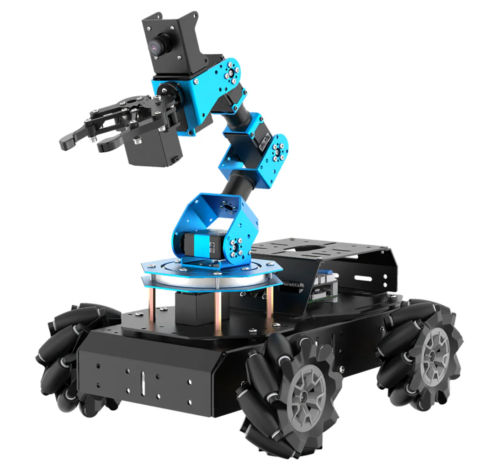
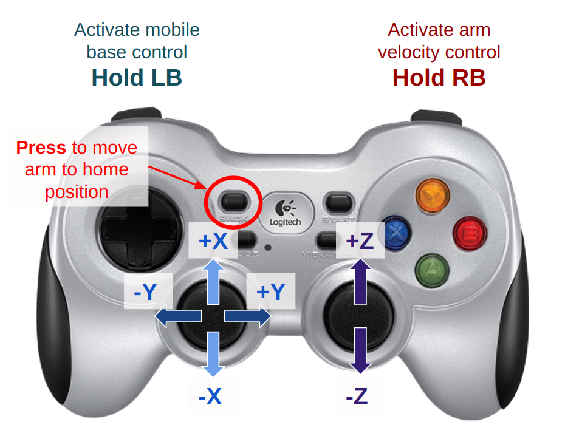
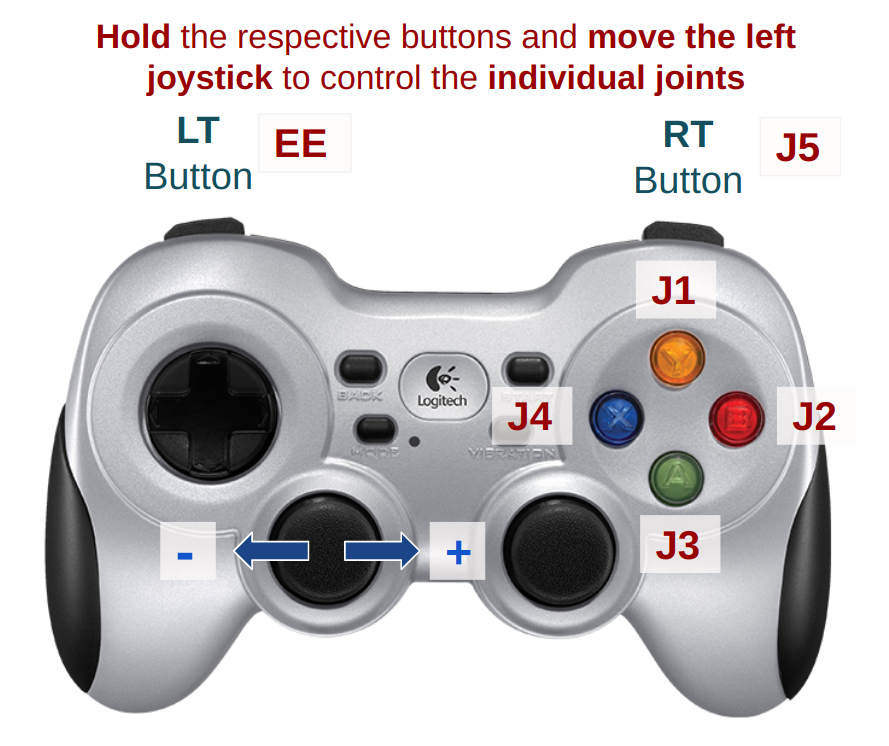

# Python Library for the Hiwonder 5-DOF Mobile Manipulator

This repository provides the python libraries for interfacing with the Hiwonder 5-DOF mobile manipulator. The robot platform has an onboard **Raspberry Pi 4B** which serves as the main compute unit of the system. The 5-DOF arm are driven by serial bus servos controlled over serial while the mobile base is driven by DC motors controlled by a custom driver board with communication over I2C.

Your project development will be done onboard the Raspberry Pi ideally over **SSH protocol**.





### Please report [robot issues here!](https://forms.gle/eETnQvGQqcb31asM8)

## Setting up the onboard Raspberry Pi

#### Step 0: Connect to the Raspberry Pi from your laptop over SSH
The steps to connect to the Raspberry Pi are listed in this doc: [FunRobo SSH Guide](https://docs.google.com/document/d/1tcrt6ZgzxWQ3hjQ34bW16oa2WLRAk_C3NH0j8XwIweM/edit?usp=sharing)
Sign up for a robot using the spreadsheet: [Robot Status](https://docs.google.com/spreadsheets/d/1j3MaXrLvoURn6myrdkA8uJrGIvR5390YH9Bjby1ctJQ/edit?usp=sharing)

  **The password is `FunR0b0!`** 

- SSH troubleshooting:
  - Make sure you are connected to the Olin Robotics network (It should work on Olin, but Olin Robotics may be faster/more stable).
  - Make sure OpenSSH Client and OpenSSH Server are installed (should be installed by default on Mac/Linux, may need to be installed under `Settings > System > Optional Features` in Windows).
  - Make sure the OpenSSH folder is added to your path. Should be `C:\Windows\System32\OpenSSH` in Windows.
  - Check the SD card to make sure the number physically written on it matches what you expect.


#### Step 1: Create a workspace and get the repositories
- Create a workspace
```bash
mkdir ~/funrobo_ws 
# this will be your default workspace for this class
```

- Get the repositories: **funrobo_hiwonder** and your forked version of **funrobo_kinematics**
```bash
# go into the workspace folder
cd funrobo_ws

git clone https://github.com/OlinCollege-FunRobo/funrobo_hiwonder.git
git clone <your funrobo_kinematics repo>
```

#### Step 2: Create a conda environment from **funrobo_hiwonder** 
- Create the virtual environment
```bash
cd funrobo_hiwonder
conda env create -f environment.yml
#May take time, especially if first time being run
```
- Activate the environment
```bash
conda activate funrobo_hw
```

### Step 3: Install both packages, following the order below
```bash
cd ~/funrobo_ws
pip install -e funrobo_kinematics
pip install -e funrobo_hiwonder
```

#### Step 4: Run the example scripts
- If setup worked well, you should be able to run the main script with the command below:
```bash
cd funrobo_hiwonder
python examples/joystick_control.py
```


### Usage Guide

 



If the positions aren't updating, check if your terminal says "Logitech Logitech Dual Action" instead of "Logitech Gamepad F310". If that's the case, make sure the back of your controller is in the X position not the D position.
